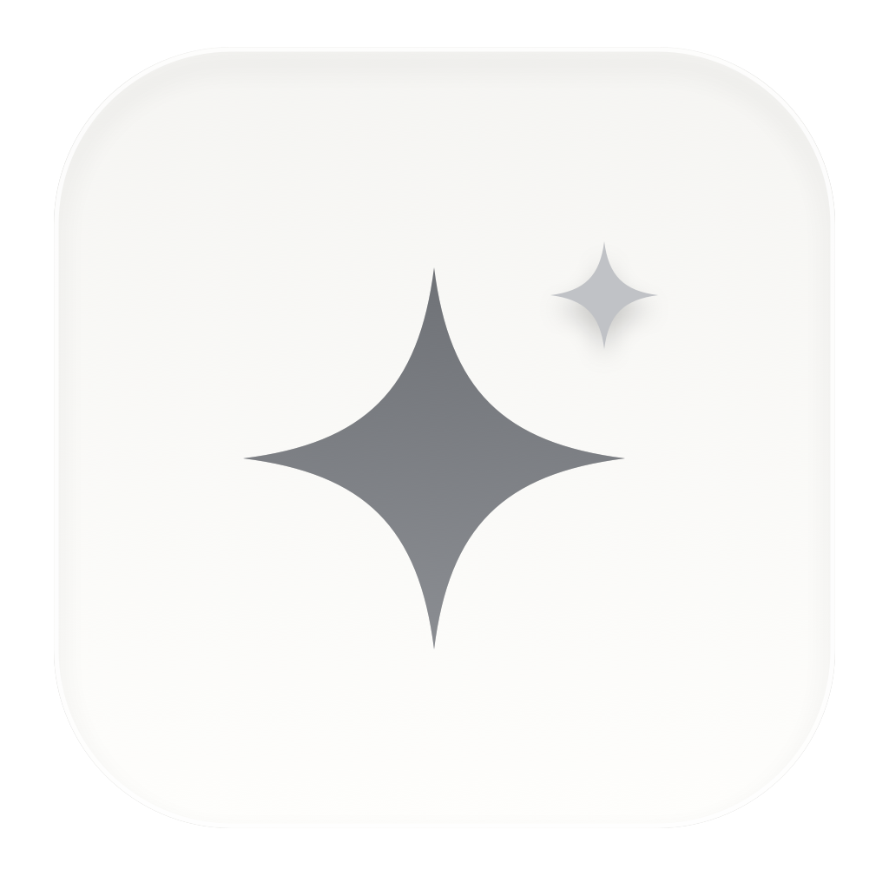

# Astra

English | [中文](README.zh.md)

<p align="center">
  <a href="docs/media/astra-product-film.mp4"></a>
</p>

<p align="center"><strong>A quiet AI assistant that notices when it can genuinely help.</strong></p>

<p align="center"><a href="docs/media/astra-product-film.mp4">▶ Watch the product film</a></p>

Astra stays beside your work on macOS, understands the visible context, and acts only when the expected value clearly exceeds the interruption and risk. It is designed to feel less like a chatbot and more like a thoughtful assistant: mostly silent, immediately useful when invited, and capable of completing real work.

## Three ways to work with Astra

- **Ambient assistance** — Astra quietly notices deadlines, risks, avoidable effort, useful ideas, and grounded moments of encouragement. Most screens produce no output.
- **Double-tap Fn** — ask Astra to understand the current screen or selected text and take the most useful next action without writing a prompt.
- **Fn + Space** — open a minimal command field when you already know what you want. Astra combines your instruction with the selection or current screen and executes it.

## Why it feels different

- Works across macOS applications without per-app integrations.
- Uses selected text as precise context and can write a verified result back into the active editor.
- Keeps notifications short while preserving complete results in a follow-up conversation.
- Can use agent tools for low-risk work and asks before consequential actions.
- Runs OCR locally with Apple Vision. Screenshots are not stored; only bounded recognized text is sent to the configured model.
- Suppresses repeated context and previously delivered results to reduce interruption and model cost.

## Current status

Astra is a private macOS developer preview built on [DeepSeek Harness](https://github.com/deepseek-ai/deepseek-harness). It is ready for local product testing, but it is not yet a notarized, self-contained distribution for other Macs.

## Run the developer preview

Requirements: macOS, Node.js 22 or later, pnpm, the Swift toolchain, a DeepSeek API key, and a local code-signing identity named `Proactive AI Local Code Signing` (or supplied through `PROACTIVE_SIGNING_IDENTITY`).

```sh
pnpm install
cp .env.example .env
# Add your own DEEPSEEK_API_KEY to .env.
pnpm run app:proactive:install
```

Grant Screen Recording, Accessibility, Notifications, and—when Double-tap Fn is used—Input Monitoring when macOS asks. The app is installed at `~/Applications/Astra.app`.

## Privacy and safety

Astra blocks common password, authentication, notification, and self-referential surfaces by default. Its app block list is a practical safeguard, not a security boundary. Do not use the preview while sensitive content is visible unless you have reviewed its configuration. Editor changes are designed to be restrained and reversible; sending, publishing, deletion, payments, and account or security changes require confirmation.

Implementation details and limitations are documented in the [Astra package reference](packages/experimental/proactive-screen/README.md) and [product design](packages/experimental/proactive-screen/DESIGN.md).

## License

[MIT](LICENSE). This repository includes and builds on DeepSeek Harness; third-party notices remain in [THIRD_PARTY_NOTICES.md](THIRD_PARTY_NOTICES.md).
