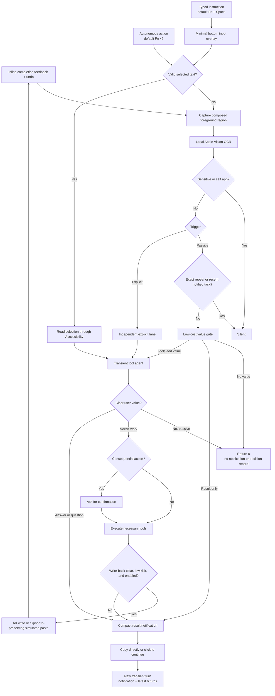

# Astra: core product design

English | [中文](DESIGN.zh.md)

## Product definition

Astra is a quiet local proactive AI assistant that can see the visible foreground screen, judge whether intervention is worthwhile, use tools when enabled, and communicate only the useful result. It is not a notification bot, screen recorder, or application-specific copilot.

Its shortest product loop is:

> See the current screen → decide whether value exists → stay silent or act → tell the user only what matters.

## First principles

| Principle | Product consequence |
|---|---|
| Context should be broad; interruption should be narrow | Ordinary visible applications share one capture path, while the agent stays silent by default. |
| The model judges semantic value | The host does not reject context by text length, visual change, or generic similarity thresholds. |
| Explicit intent outranks ambient perception | Autonomous action and typed instruction run on explicit lanes; a deliberate text selection narrows that request to the selection alone. |
| Action and notification are independent | The agent may answer, ask, research, or execute; notification is only the final delivery channel. |
| Authority must be legible | Low-risk reversible work may run; consequential actions require confirmation. |
| Ambient context should not become durable memory | Screenshots and OCR are not persisted; each agent session is short-lived. |

## Core flow

## Trigger semantics

### Passive perception

Current OCR is untrusted user-level context. Passive mode first uses a direct, tool-free model call with a small output budget. It returns `0`, a finished notification, or `ACT`; only `ACT` starts the full tool agent. Practical and emotional value share one threshold. Emotional intervention must be grounded in a clearly meaningful visible achievement, milestone, recovery, or difficult effort, and recognize why it matters rather than merely restating it. Routine success UI, generic praise, guessed feelings, and companionship filler remain silent. The host handles only deduplication, protocol enforcement, and verified execution results, with no app-specific prompt branches.

### Autonomous action

Autonomous action defaults to Fn×2 and means “decide and help with this now.” A valid selected-text value becomes the complete task context and no screenshot is taken; without a selection, the request falls back to current-screen capture. It bypasses passive deduplication, runs independently, and must return direct value, complete a safe action, or ask one necessary concise question. A non-activating star pulse remains at bottom center until completion, then becomes a checkmark; triggering again cancels an in-flight action.

### Typed instruction

Typed instruction defaults to Fn + Space. The bottom-center star expands into a non-activating input-only overlay; it becomes the key window for macOS input-method composition without showing the controller, and Enter sends while Escape or an outside click cancels. Enter on an empty input behaves like autonomous action. Selection plus instruction processes only the selection with the instruction as primary intent; without a selection, current-screen OCR accompanies the instruction. Both explicit shortcuts are independently configurable and checked against macOS, other applications, and each other.

### In-place write-back

The “edit input field” switch controls whether triggers expose a native editor tool. The host writes only to the Accessibility editor and range captured when the request began. If that target or its content changes, disappears, or rejects mutation, it stops rather than redirecting the edit to a later focused field. A successful write uses a host-owned verified receipt, never a model claim about saving or sending, skips a redundant notification, and offers a guarded undo while the inserted content is still unchanged.

### Continue conversation

Clicking a notification opens a standard resizable conversation window. The notification and latest six turns are sent to a fresh agent session on each request, while the complete bounded visible history is stored locally by result identity and survives closing or reopening the window.

## Capability modes

| Mode | Available behavior |
|---|---|
| Companion | Silent, answer, ask, and notify; no execution tools are mounted. |
| Assistant | The same judgment policy plus standard Harness tools; proactive editing adds in-place write-back. |

In Assistant mode, clear low-risk reversible work may run autonomously. Sending, submitting, publishing, deleting or overwriting, payments, and account, security, privacy, or permission changes require confirmation.

## User experience

- The app remains a small window and menu-bar item centered on perception, effort, execution, and proactive editing.
- Light, Standard, Focus, and High correspond to 60, 15, 5, and 1 second intervals.
- Autonomous action and typed instruction shortcuts are independently configurable with conflict checks.
- Explicit requests use selected text alone when available and otherwise capture the screen. Feedback and the typed input overlay appear at bottom center.
- The agent edits the active field only when write-back is enabled, the target has not changed, and the change is clear and low-risk.
- Notifications contain the result, not observation, reasoning, plans, or tool narration. Successful in-place edits use lightweight completion feedback instead of another notification.
- A notification can be copied or opened for continued conversation.
- Recent results are folded by default; system status and diagnostics are separate and contain no OCR text.
- The menu bar can pause for one hour, pause passive perception in the current app, and undo the latest safe write-back.
- Screenshots stay in memory. Activity history stores bounded metadata and accepted notification text only.

## Deliberate constraints

- Passive context contains only visible foreground text. Explicit requests can additionally read the current selection and editable focus through macOS Accessibility; hidden content, image meaning, audio, and application-internal state are not understood.
- Write-back covers most native, browser, and Electron text editors. Secure fields, protected editors, canvas editors, and applications without an exposed editable focus reject the write and fall back to a notification result.
- A foreground application may mark its window non-shareable. Passive perception skips it. An explicit request silently falls back to the containing display, marks the protected foreground as omitted for the model, and uses the typed instruction plus other visible context without exposing capture details.
- Input is bounded to control provider cost; long screens may be truncated.
- Password managers, macOS credential and authentication surfaces, Notification Center, and the controller itself are blocked heuristically.
- Consecutive identical OCR and substantial overlap with a recent notification are suppressed before a model call.
- There is no ambient cross-screen memory, durable reminder scheduler, keyboard text capture, or per-application adapter.
- DRM, application-protected, or system-protected surfaces cannot be read.

## Cost model

Local capture, selection access, write-back, and Vision OCR have no provider fee. A model call occurs for non-empty passive context that survives deduplication and every submitted explicit request; cancelling the input overlay makes no model call. High can therefore be expensive; Standard is the default. Output uses reasoning off, bounded step output, transient sessions, and one-token `0` silence.

## Delivery boundary

The deliverable is intentionally one universal current-screen assistant. Cross-screen memory, calendar/location sources, durable automations, semantic application APIs, and richer multimodal perception should be added only when a validated user scenario cannot be solved by this loop.
