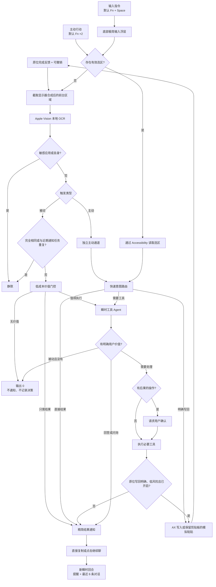

# Astra：核心产品设计

[English](DESIGN.md) | 中文

## 产品定义

Astra 是一个安静的本地主动 AI 助手：它能看见前台屏幕的可见内容，判断现在是否值得介入，在允许时使用工具，并且只把有价值的结果告诉用户。它不是通知机器人、录屏工具，也不是逐应用 Copilot。

最短产品闭环是：

> 看见当前画面 → 判断是否有价值 → 静默或行动 → 只告诉用户必要结果。

## 第一性原则

| 原则 | 产品结果 |
|---|---|
| 上下文应广，打扰应窄 | 普通可见应用共用一条感知路径，Agent 默认静默。 |
| 语义价值由模型判断 | Host 不再按字数、画面变化或通用相似度阈值拒绝上下文。 |
| 明确意图高于环境感知 | 主动行动与输入指令分别进入独立主动通道；用户主动选择文字时，该次请求只以选区为上下文。 |
| 行动与通知相互独立 | Agent 可以回答、问询、查询或执行；通知只是最后的交付通道。 |
| 权限必须可理解 | 低风险可恢复工作可执行；有后果的操作先确认。 |
| 环境上下文不应变成长期记忆 | 截图与 OCR 不持久化，每个 Agent Session 都是短生命周期。 |

## 核心流程

## 触发语义

### 被动感知

Agent 以不可信的 user 层观察获得当前 OCR 上下文，通用介入策略则位于 Agent 作用域的 system instruction。被动模式先经过一个无工具、短输出的低成本价值门控：无价值就严格输出 `0`；只需一句成品结果就直接交付；只有工具能显著增加价值时才启动完整 Agent。实际价值与情绪价值使用同一标准——必须基于画面中明确发生的事、具体而真诚，并且明显高于打扰与负面影响；泛泛鼓励、猜测情绪和陪伴式填充一律没有价值。Host 只负责去重、协议与执行结果校验，不为邮件、聊天、网页、文档等场景编写独立规则。

### 主动行动

主动行动默认为 Fn×2，表示“现在由你判断并帮我处理”。存在有效选中文字时，该选区成为本次请求的完整上下文且不再截图；没有选区时回退到当前画面截图。它绕过被动去重，先由快速意图路由在“直接结果、写回编辑区、升级工具 Agent”之间选择；能回答或编辑就不加载完整工具上下文。上下文不足时只提出一个必要的精简问题。触发后会在屏幕下方中央显示不抢焦点的星光反馈，完成后变为勾；再次触发可以取消仍在进行的请求。若触发时 Astra 自身或敏感应用在前台，则不读取该画面，立即结束动画并提示用户切回目标内容。

### 输入指令

输入指令默认为 Fn + Space。星光在屏幕下方中央展开成不激活 App 的纯输入浮层；浮层会成为 key window 以支持 macOS 输入法组合与候选窗，但不会显示控制台主窗口，回车发送，Esc 或点击其他位置取消，空输入回车等同于主动行动。选区与指令同时存在时，Agent 只处理选区并以指令为首要意图；无选区时使用当前画面与指令。两个主动入口都可以分别自定义快捷键并检测系统、其他应用以及彼此的冲突。

### 原位写回

“编辑输入区”统一控制所有触发的写回能力。快速意图路由可以在 `APPEND`、`REPLACE` 与普通结果之间选择；完整 Agent 也可以调用同一原生写回工具，因此它不是邮件、文档或聊天的定制功能。编辑区只是可选且风险更高的输出通道，存在编辑区本身不是写入理由；数据、总结、分析、建议与不确定的改写通常只返回结果。写入的价值门槛高于通知，被动场景只允许极少数明确、客观、低风险的小幅追加。所有场景优先插入或在选区后追加，不删除现有文字；替换必须同时具有用户主动选区和明确的改写、替换或纠正指令，宿主会再次校验这一授权。没有捕获到编辑区时仍正常分析、回答或使用工具。宿主只使用请求发起时捕获的 Accessibility 编辑目标与范围；位置或内容变化、目标消失或拒绝修改时立即停止，绝不转写到后来获得焦点的输入框。写入先尝试 Accessibility，失败时保存剪贴板全部内容、把模拟粘贴只发送给原进程并恢复剪贴板。写入成功后发送一次由宿主验证的精简确认，不重复正文，也不接受模型声称的“已保存/已发送”；最近一次仍可安全验证的写入可以撤销。

### 继续聊

点击通知打开标准可缩放对话窗口。每次请求都把原提醒与最近六条对话交给一个新的 Agent Session；完整、有界的可见历史按结果身份保存在本地，关闭或重新打开窗口仍可恢复。

## 能力模式

| 模式 | 可用行为 |
|---|---|
| 陪伴模式 | 静默、回答、问询和通知；不挂载执行工具。 |
| 助手模式 | 使用同一判断策略，并挂载 Harness standard 工具进行查询和本地工作；开启主动编辑后还可原位写回。 |

助手模式下，明确、低风险、可恢复的工作可以自主执行。发送、提交、发布、删除或覆盖、付款，以及账户、安全、隐私或权限变更必须先确认。

## 用户体验

- App 由一个小窗口和菜单栏入口组成，核心设置只有感知、强度、执行与编辑输入区。
- Light、Standard、Focus、High 分别对应 60、15、5、1 秒。
- 主动行动与输入指令快捷键都可以自定义并检查冲突。
- 主动请求有选区时只读取选区，否则截图；星光反馈与输入浮层位于屏幕下方中央。
- Agent 只有在写回开关开启、目标未变化且改动明确低风险时才编辑当前输入区。
- 通知只包含结果，不包含观察、思考、计划或工具过程；原位完成只给轻量反馈，不再额外弹通知。
- 提醒可以直接复制，也可以点击继续聊。
- 最近结果默认折叠；系统状态和诊断信息独立展示且不包含 OCR 原文。
- 菜单栏可以暂停一小时、暂停感知当前 App，以及撤销最近一次安全写回；主动触发不受单 App 暂停影响。
- 截图只留在内存；活动历史只保存有界元数据与已接受的提醒文案。

## 有意保留的约束

- 被动上下文只能获得前台可见文字；主动请求还可以通过 macOS Accessibility 读取当前选区和可编辑焦点，但仍不能理解隐藏内容、纯图片含义、音频或应用内部状态。
- 原位写回覆盖大多数原生、浏览器与 Electron 文本编辑器；安全输入框、受保护编辑器、Canvas 编辑器或不暴露可编辑焦点的应用会拒绝写入并退回通知结果。
- 前台应用可以把窗口标记为禁止共享。被动感知直接跳过；主动请求静默回退到窗口所在的整块屏幕，并在模型上下文中标记前台内容缺失，使用用户指令和其他可见信息继续处理，不向用户暴露截图细节。
- 输入长度有界以控制 provider 成本；很长的画面可能被截断。
- 密码管理器、macOS 凭据与身份验证界面、通知中心、控制台自身通过启发式规则屏蔽。
- 同应用连续完全相同的 OCR，以及与近期通知显著重合的任务，会在模型调用前抑制。
- 不包含跨屏幕环境记忆、持久提醒调度、键盘文字采集或逐应用适配。
- DRM、应用保护或系统保护画面无法读取。

## 成本模型

本地截图、选区读取、原位写回与 Vision OCR 没有 provider 费用。非空的被动上下文通过去重后只调用无工具、短输出的价值门控；门控返回 `ACT` 时才承担完整工具 Agent 的成本。主动请求先经过同样轻量的意图路由：能直接回答就返回结果，适合原位编辑就返回 `WRITE`，确实需要工具时才进入完整 Agent。High 会增加门控调用频率，默认使用 Standard。取消输入浮层不会调用模型。模型关闭 reasoning、限制输出、使用瞬时 Session，并用 `0` 表示被动场景完全静默。

## 交付边界

当前交付刻意保持为一个通用的“当前画面助手”。跨屏幕记忆、日历或位置来源、持久自动化、应用语义 API 与更丰富的多模态感知，只应在经过验证的用户场景无法由这条闭环解决时再加入。
